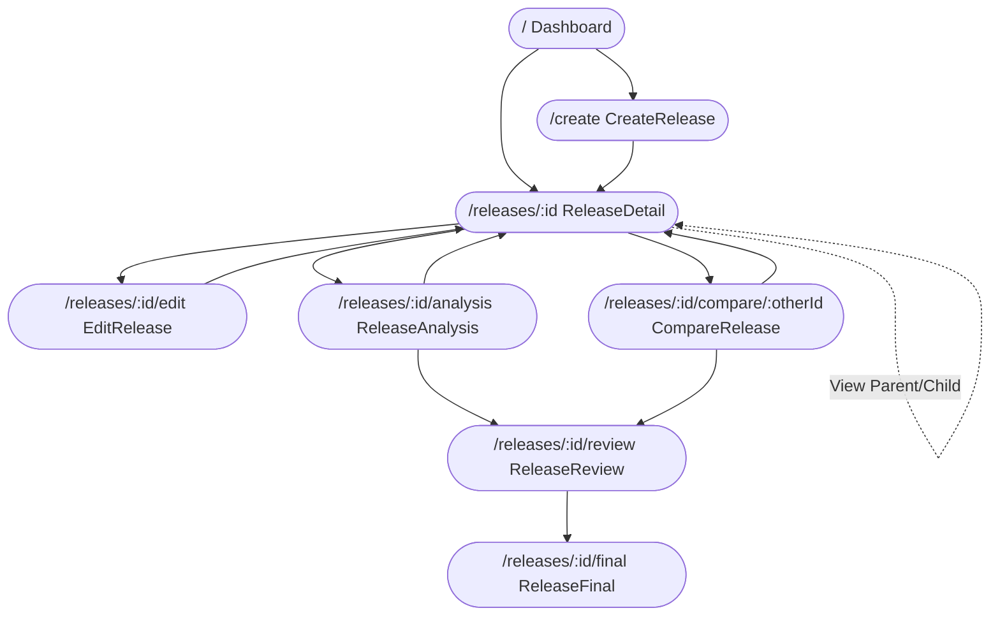
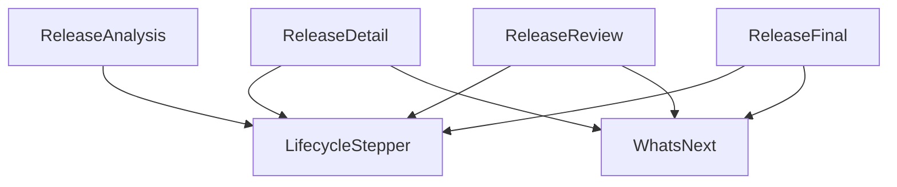
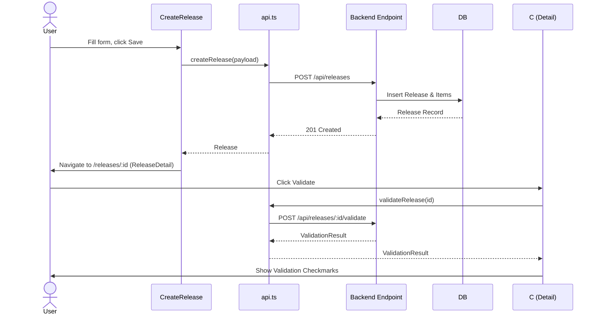
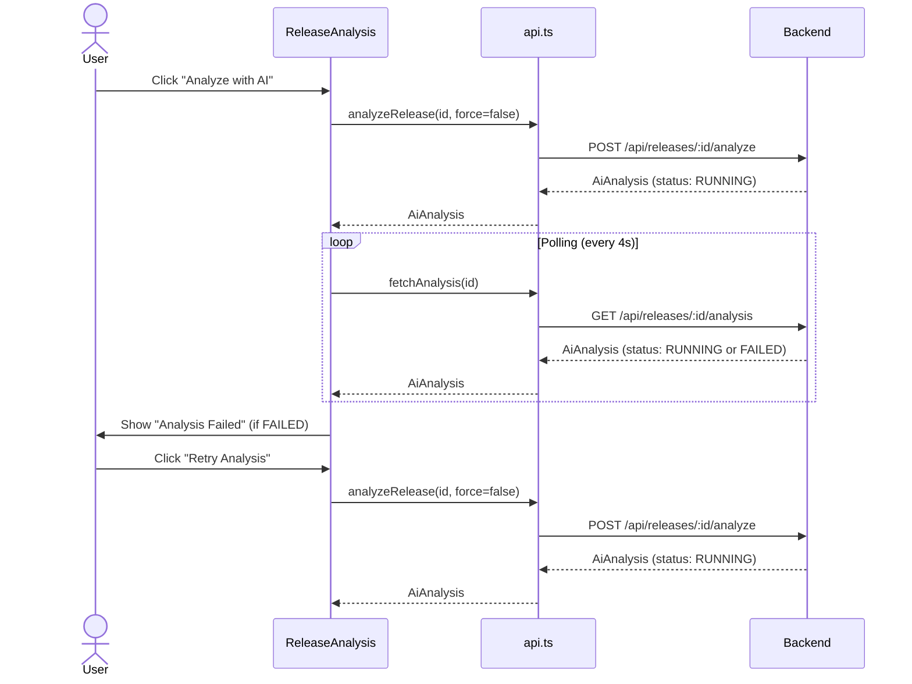
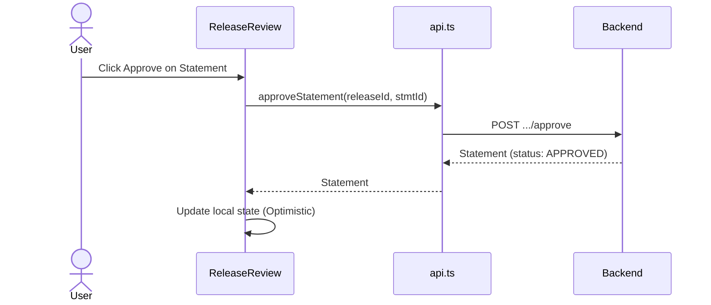
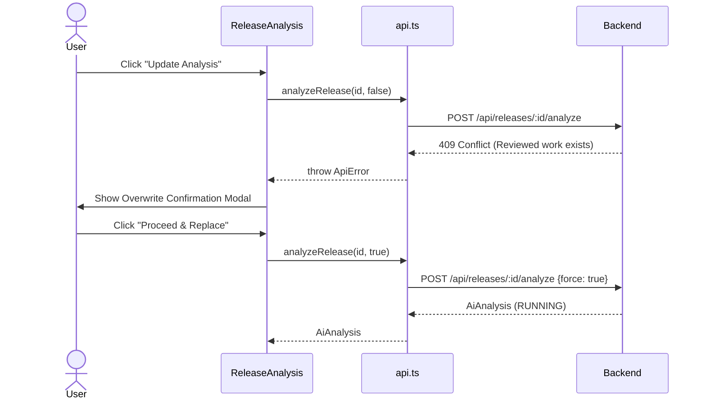
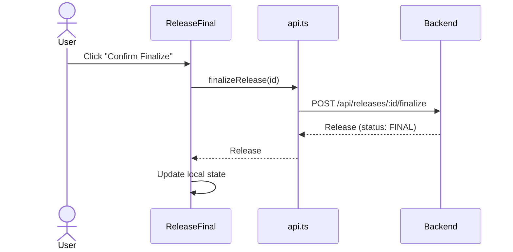
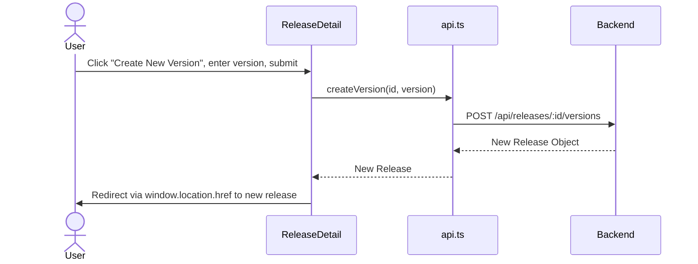
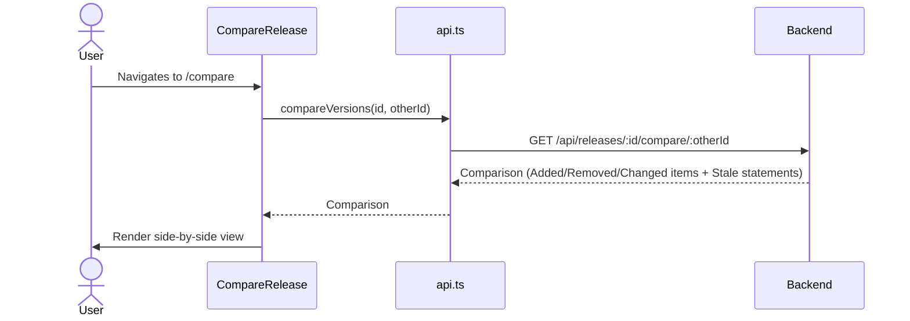
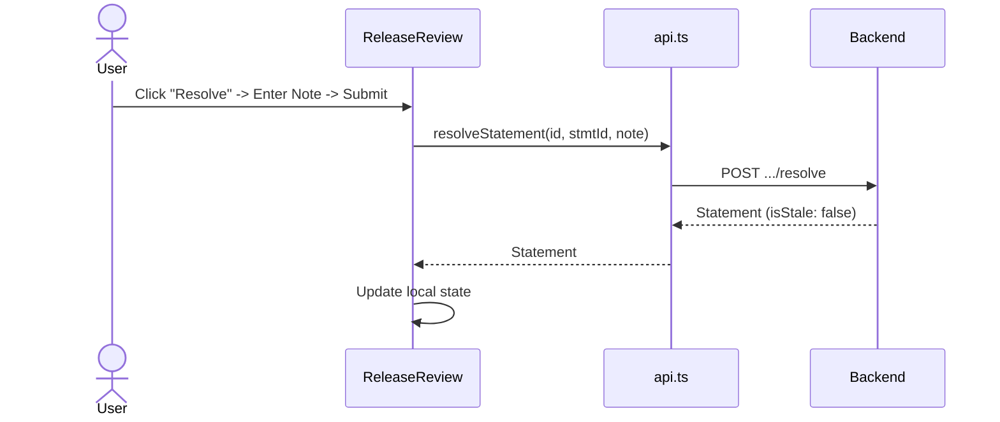

# Frontend Architecture

## 1. Overview and Folder Tree
The `client/` directory contains the React frontend application built with Vite and Tailwind CSS.
```text
client/
├── package.json - Project metadata, scripts, and dependencies.
├── vite.config.ts - Vite configuration, including the backend proxy.
├── index.html - Application entry point (implicit from structure, typical for Vite).
└── src/
    ├── index.css - Global styles and Tailwind CSS variables/theme configuration.
    ├── main.tsx - Application root mount point.
    ├── App.tsx - Application router definition (`BrowserRouter`).
    ├── api.ts - All backend API fetch calls and TypeScript interfaces.
    ├── components/
    │   ├── LifecycleStepper.tsx - Renders the 4-step process timeline across pages.
    │   └── WhatsNext.tsx - Renders contextual next steps/warnings for a release.
    └── pages/
        ├── Dashboard.tsx - Lists all releases and allows creating or loading demos.
        ├── CreateRelease.tsx - Form to create a new release and add items.
        ├── ReleaseDetail.tsx - Shows release items, validation status, and version lineage.
        ├── EditRelease.tsx - Form to edit an existing release and its items.
        ├── CompareRelease.tsx - Compares two versions and highlights added/removed/changed items and stale statements.
        ├── ReleaseAnalysis.tsx - Triggers and polls AI analysis, showing impacts, claims, and risks.
        ├── ReleaseReview.tsx - Form to review (approve/reject/edit/resolve) AI-generated statements.
        └── ReleaseFinal.tsx - Shows the final approved internal/client brief, risks, and limitations.
```

## 2. Tech and Setup
*   **React:** `19.2.8`
*   **Vite:** `8.3.0`
*   **Tailwind CSS:** `4.3.3` (via `@tailwindcss/vite` plugin)
*   **Router:** `react-router-dom` `7.18.4` (using `BrowserRouter`)
*   **Dev Proxy:** In `vite.config.ts`, `/api` and `/health` requests are proxied to `http://localhost:3001`.
*   **Env variables:** No explicit environment variables are referenced in the frontend codebase.
*   **Scripts:**
    *   `dev`: `vite`
    *   `build`: `tsc -b && vite build`
    *   `lint`: `oxlint`
    *   `preview`: `vite preview`

## 3. Routing
| Route | Page Component | What the user sees |
| :--- | :--- | :--- |
| `/` | `Dashboard` | List of releases, "Load Demo", and "Create Release" buttons. |
| `/create` | `CreateRelease` | Form to input version, title, and add multiple release items. |
| `/releases/:id` | `ReleaseDetail` | Release metadata, items list, validation results, and version lineage. |
| `/releases/:id/edit` | `EditRelease` | Form pre-filled with release details to update items. |
| `/releases/:id/analysis` | `ReleaseAnalysis` | Analysis status, impacts, risks, claims, and coverage warnings. |
| `/releases/:id/review` | `ReleaseReview` | List of statements pending review, with actions to approve, reject, edit, or resolve. |
| `/releases/:id/final` | `ReleaseFinal` | Finalized statement briefs, known limitations, risks, and evidence list. |
| `/releases/:id/compare/:otherId` | `CompareRelease` | Side-by-side comparison of items between versions, and listed stale statements. |



## 4. `api.ts` Function Table
| Name | HTTP Method | Path | Request Body | Response Type | Called By |
| :--- | :--- | :--- | :--- | :--- | :--- |
| `fetchReleases` | GET | `/api/releases` | - | `Release[]` | Dashboard |
| `fetchRelease` | GET | `/api/releases/${id}` | - | `Release` | CompareRelease, ReleaseDetail, EditRelease, ReleaseAnalysis, ReleaseReview, ReleaseFinal |
| `validateRelease` | POST | `/api/releases/${id}/validate` | - | `ValidationResult` | ReleaseDetail |
| `createRelease` | POST | `/api/releases` | `CreateReleasePayload` | `Release` | CreateRelease |
| `generateDemoRelease` | POST | `/api/releases/demo` | - | `Release \| {success: boolean}` | Dashboard |
| `updateRelease` | PATCH | `/api/releases/${id}` | `Partial<CreateReleasePayload>` | `Release` | EditRelease |
| `finalizeRelease` | POST | `/api/releases/${id}/finalize` | - | `Release` | ReleaseFinal |
| `createVersion` | POST | `/api/releases/${id}/versions` | `{ version: string }` | `Release` | ReleaseDetail |
| `compareVersions` | GET | `/api/releases/${id}/compare/${otherId}` | - | `Comparison` | CompareRelease |
| `analyzeRelease` | POST | `/api/releases/${id}/analyze` | `{ force: boolean }` | `AiAnalysis` | ReleaseAnalysis |
| `fetchAnalysis` | GET | `/api/releases/${id}/analysis` | - | `AiAnalysis \| null` | ReleaseAnalysis, ReleaseFinal |
| `fetchStatements` | GET | `/api/releases/${id}/statements` | - | `Statement[]` | ReleaseReview, ReleaseFinal |
| `approveStatement` | POST | `/api/releases/${id}/statements/${statementId}/approve` | - | `Statement` | ReleaseReview |
| `rejectStatement` | POST | `/api/releases/${id}/statements/${statementId}/reject` | - | `Statement` | ReleaseReview |
| `resolveStatement` | POST | `/api/releases/${id}/statements/${statementId}/resolve` | `{ note: string }` | `Statement` | ReleaseReview |
| `updateStatementContent`| PATCH | `/api/releases/${id}/statements/${statementId}` | `{ statement: string }` | `Statement` | ReleaseReview |

## 5. Components & Pages
### `LifecycleStepper`
*   **Purpose:** Renders the 4-step progress bar (Package, Analysis, Review, Final Brief) for a release.
*   **Props & State:** `releaseId`, `status`. No local state.
*   **Effects:** None.
*   **User Actions:** Links navigate to corresponding paths (`/analysis`, `/review`, `/final`) if the status level is unlocked.
*   **Conditions:** Steps are locked (unclickable, grayed out) if `status` is less than `minStatus` for that step.

### `WhatsNext`
*   **Purpose:** Renders a contextual alert box recommending the next logical user action based on the release status.
*   **Props & State:** `releaseId`, `status`, `canAnalyze`, `analysisOutdated`, `staleCount`, `pendingCount`. No local state.
*   **Effects:** None.
*   **User Actions:** Single action button navigating to `/edit`, `/analysis`, `/review`, or `/final` depending on state.
*   **Conditions:** Background color turns orange (`isWarning`) if analysis is outdated, statements are stale, or draft is incomplete.

### `Dashboard`
*   **Purpose:** Lists all releases and provides entry points to create or load demo releases.
*   **Props & State:** `releases` (Release array), `loading` (boolean), `loadingDemo` (boolean), `error` (string).
*   **Effects:** Mount: Fetches releases via `fetchReleases()`.
*   **User Actions:** 
    *   "Load Demo": Calls `generateDemoRelease()`, refetches, updates `releases`.
    *   Clicking a release: Navigates to `/releases/:id`.
*   **Badges:** Renders `status` badge. Detects "DEMO" title prefix to render a Demo badge.

### `CreateRelease`
*   **Purpose:** Form to create a new release and add initial items.
*   **Props & State:** `version`, `title`, `items` (ItemDraft[]), `expandedIds` (Set of item IDs), `submitting`, `error`.
*   **Effects:** None.
*   **User Actions:**
    *   "+ Add Item": Appends a new item to `items` and expands it.
    *   "Save Changes": Submits `createRelease()` -> navigates to `/releases/:id`.
*   **Conditions:** "Draft in progress" floating bar appears if any input has values. Save disabled while submitting.

### `EditRelease`
*   **Purpose:** Form to edit an existing release metadata and its items.
*   **Props & State:** `version`, `title`, `items`, `expandedIds`, `submitting`, `loading`, `error`, `initialData`.
*   **Effects:** Mount: Fetches release via `fetchRelease()`, sets initial state.
*   **User Actions:**
    *   "Save Changes": Submits `updateRelease()` -> navigates to `/releases/:id`.
*   **Conditions:** "Unsaved changes" floating bar appears only when `isDirty` is true (compared against `initialData`).

### `ReleaseDetail`
*   **Purpose:** Shows release items, version history, validation status, and provides the "Validate" action.
*   **Props & State:** `release`, `loading`, `error`, `validating`, `validationResult`, `validationError`, `versionModalOpen`, `newVersionInput`, `creatingVersion`, `versionError`.
*   **Effects:** Mount: Fetches release via `fetchRelease()`.
*   **User Actions:**
    *   "Validate": Calls `validateRelease()` -> displays `validationResult`.
    *   "Create New Version": Opens modal -> Calls `createVersion()` -> sets window location.
*   **Conditions:** "Analyze with AI" is disabled if the release doesn't contain at least one of every required item type (Feature/Bug, Behavior, QA, Limitation, Migration, Group).
*   **Badges:** "⚠ Number Mismatch" badge if numbers in item title don't appear in the content. Status badges for lineage versions.

### `ReleaseAnalysis`
*   **Purpose:** Triggers and polls the AI analysis job, displaying the resulting JSON impact, risks, and claims.
*   **Props & State:** `release`, `analysis`, `loading`, `analyzing`, `error`, `modalStep` (for CONFIRM overwrite).
*   **Effects:** 
    *   Mount: Fetches release and analysis.
    *   Polling: If `analysis.status === "RUNNING"`, polls `fetchAnalysis()` every 4s. Cleared on unmount.
*   **User Actions:**
    *   "Analyze with AI" / "Update Analysis": Calls `analyzeRelease(force)`. On 409 error (reviewed work exists), opens `modalStep = 'CONFIRM'`.
    *   "Proceed & Replace": Calls `analyzeRelease(true)`.
*   **Conditions:** Analyzed disabled if missing QA evidence or Changes. "Update Analysis" warning shown if items updated after analysis `completedAt`.
*   **Badges:** Impact colors, Support colors, Risk kind colors, and "⚠ Unverified" downgrades.

### `ReleaseReview`
*   **Purpose:** Allows reviewing, editing, approving, rejecting, or resolving stale AI-generated statements.
*   **Props & State:** `release`, `statements`, `loading`, `error`, `editingId`, `editContent`, `resolvingId`, `resolveNote`.
*   **Effects:** Mount: Fetches release and statements.
*   **User Actions:**
    *   "Approve": Calls `approveStatement()` -> updates statement in state.
    *   "Reject": Calls `rejectStatement()` -> updates statement in state.
    *   "Save (Edit)": Calls `updateStatementContent()` -> updates statement in state.
    *   "Resolve (Stale)": Calls `resolveStatement()` -> updates statement in state.
*   **Conditions:** Approve disabled if stale or already approved. Reject disabled if rejected. Resolve shown only if `isStale`.
*   **Badges:** `STALE` (reads `isStale`), `EDITED` (reads `isEdited`), `IMPACT` and `SUPPORT_STATUS` badges.

### `ReleaseFinal`
*   **Purpose:** Displays the final, filtered release briefs for internal and client audiences, plus limitations and risks.
*   **Props & State:** `release`, `statements`, `analysis`, `loading`, `error`, `finalizing`.
*   **Effects:** Mount: Fetches release, statements, and analysis.
*   **User Actions:**
    *   "Confirm Finalize": Calls `finalizeRelease()` -> updates release status to `FINAL`.
*   **Conditions:** If `finalizeRelease` fails due to pending/stale statements (400 ApiError with details), displays a specific error UI with counts and a "Go to Review" link.
*   **Badges:** Status badge.

### `CompareRelease`
*   **Purpose:** Compares two releases, showing added/removed/changed items and stale statements.
*   **Props & State:** `comparison` (Comparison), `release` (Release), `loading`, `error`.
*   **Effects:** Mount: Fetches release and `compareVersions()`.
*   **User Actions:** Links navigate to review page or home.
*   **Badges:** `ADDED`, `REMOVED`, `CHANGED`, `UNCHANGED` badges based on `changeCategory`.

## 6. Component Dependency Map


## 7. State and Data Flow
*   **Data Living:** Data lives purely in local component state (`useState`). There is no global state management (like Redux/Zustand) or frontend caching library (like React Query).
*   **Cross-page flow:** When a change is made on one page (e.g., editing a release), the UI navigates back to a display page. The display page's `useEffect` re-fetches the data on mount to get the latest state.
*   **Optimistic updates:** Found in `ReleaseReview.tsx`. When approving, rejecting, editing, or resolving a statement, the component immediately updates its local `statements` array using the response from the API without requiring a full page reload.
*   **Polling:** Handled explicitly via `setInterval` in `ReleaseAnalysis.tsx`. It polls every 4000ms if `analysis.status === "RUNNING"` and updates the state.
*   **Caching:** None. Every navigation mount triggers a fresh API call.

## 8. End-to-End Flows
### a) Create release and validate


### b) Analyze with AI (including polling and failure/retry)


### c) Review: Edit, Approve, Reject


### d) Re-analyze with confirmation dialog (force)


### e) Finalize and final brief


### f) Create version & edit item


### g) Compare versions


### h) Resolve a stale statement


## 9. UI States Audit
| Page | Loading Handled? | Empty Handled? | Error Handled? | Retry Handled? |
| :--- | :--- | :--- | :--- | :--- |
| `Dashboard` | Yes | Yes | Yes | No |
| `CreateRelease` | No (Sync) | N/A | Yes | Yes (Submit again) |
| `ReleaseDetail` | Yes | N/A | Yes | No |
| `EditRelease` | Yes | N/A | Yes | Yes (Submit again) |
| `ReleaseAnalysis` | Yes | N/A | Yes | Yes (Retry Analysis) |
| `ReleaseReview` | Yes | Yes (no statements) | Yes | No |
| `ReleaseFinal` | Yes | Yes (no statements/items) | Yes | No |
| `CompareRelease` | Yes | Yes (no changes) | Yes | No |

## 10. Security and Safety
*   **HTML Rendering:** No instances of `dangerouslySetInnerHTML`. User input and AI model text are rendered safely using standard React text nodes (e.g., `{item.content}` and `{stmt.statement}`).
*   **API Key Management:** API keys are never handled or referenced in the frontend. All AI interactions occur via proxy to the backend.
*   **Error Messages:** Errors caught from `fetch` (including raw `err.message`) are often directly rendered in the UI (e.g., `{error}`). `ApiError.details` is surfaced safely during Finalize.

## 11. Known Gaps
*   **Duplicated Logic:** Constant dictionaries for badge styling (`STATUS_COLORS`, `IMPACT_COLORS`, `SUPPORT_COLORS`) and item types are repeatedly defined across multiple components. The `WhatsNext` component props construction is duplicated on several pages. 
*   **Huge Components:** `ReleaseDetail.tsx` (452 lines), `ReleaseAnalysis.tsx` (551 lines), and `CreateRelease.tsx` (312 lines) handle a lot of inline styling, nested mapping, and modals.
*   **Missing Error States:** `Dashboard` lacks a retry mechanism for its initial fetch.
*   **Inline Fetch Calls:** Inside `ReleaseDetail.tsx`, `createVersion` is imported and called inline dynamically `const { createVersion } = await import("../api");` instead of at the top of the file. 
*   **Type Mismatches:** Handled cleanly mostly. The API interface for `AiAnalysis.resultJson` is typed as `any`.
*   **Leaked Intervals:** None. The polling interval in `ReleaseAnalysis.tsx` is properly cleaned up in the `useEffect` cleanup function.

---
*Things I could not verify: None. All details were extracted directly from the codebase.*
